# AI Assistant — Architecture Document

> **Version:** 1.0.0
> **Date:** 2026-02-26
> **Spec Reference:** [`docs/specification.md`](specification.md)
> **Language:** Rust · **LLM Backend:** Claude API via reqwest
> **Semantic Memory:** ruvector ecosystem (git submodule — read-only)

---

## 1. Directory Structure

```
ai-assistant/
├── Cargo.toml                       # Workspace manifest, ruvector path deps
├── .env.example                     # Template — no real secrets
├── .gitignore                       # Ignores models/, .env, target/
├── mcp_servers.json                 # Optional MCP tool definitions
├── models/                          # ONNX model files (gitignored)
│   └── paraphrase-multilingual-MiniLM-L12-v2/
│       ├── model.onnx
│       └── tokenizer.json
├── prompts/                         # Language-specific system prompts
│   ├── system_en.txt
│   └── system_tr.txt
├── ruvector/                        # Git submodule — DO NOT MODIFY
│   ├── agentic-db/
│   ├── ruvector-graph/
│   ├── ruvector-math/
│   ├── ruvector-solver/
│   ├── ruvector-mincut/
│   ├── ruvector-verified/
│   ├── rvf-runtime/
│   ├── rvf-crypto/
│   ├── prime-radiant/
│   └── sona/
├── docs/
│   ├── specification.md             # Full technical spec & pseudocode
│   └── architecture.md              # This document
├── src/
│   ├── main.rs                      # Entry point, REPL loop (~80 lines)
│   ├── config.rs                    # .env loading, Config struct (~60 lines)
│   ├── types.rs                     # Shared data types (~150 lines)
│   ├── error.rs                     # AiAssistantError enum (~80 lines)
│   ├── language.rs                  # Language detection via whatlang (~40 lines)
│   ├── embedding.rs                 # ONNX embedding provider (~100 lines)
│   ├── memory.rs                    # AgenticDB wrapper (~120 lines)
│   ├── graph_context.rs             # Graph queries, RAG, GNN (~130 lines)
│   ├── coherence.rs                 # Prime-radiant coherence (~80 lines)
│   ├── claude_api.rs                # Claude HTTP client (~150 lines)
│   ├── mcp_tools.rs                 # MCP tools loader (~120 lines)
│   ├── verification.rs              # Proof validation, witness chain (~100 lines)
│   ├── learning.rs                  # SONA trajectories (~90 lines)
│   ├── audit.rs                     # RVF audit trail (~80 lines)
│   └── pipeline.rs                  # 10-step orchestrator (~200 lines)
└── tests/
    ├── test_config.rs
    ├── test_embedding.rs
    ├── test_memory.rs
    ├── test_pipeline.rs
    └── ...                          # ~141 TDD anchors total
```

**Rationale:** Every source file stays under 500 lines. Each module has a single
responsibility. The `ruvector/` submodule is referenced via Cargo path dependencies
and is never modified.

---

## 2. Module Dependency Diagram


**Legend:**
- 🔵 Blue = Orchestrator (`pipeline.rs` — central hub)
- 🟢 Green = Core domain modules (each wraps a ruvector subsystem)
- 🟡 Yellow = Infrastructure (`main.rs`, `config.rs`)
- 🔴 Red = Shared types & utilities (`types.rs`, `error.rs`, `language.rs`)

---

## 3. Data Flow Diagram — 10-Step Pipeline

```mermaid
flowchart TB
    INPUT["👤 User Input<br/>(raw string)"]

    subgraph PIPELINE["pipeline::execute_turn()"]
        direction TB
        S1["<b>Step 1</b><br/>Receive & Validate<br/><i>sanitize, detect language</i>"]
        S2["<b>Step 2</b><br/>Embed & Semantic Search<br/><i>ONNX → AgenticDB</i>"]
        S3["<b>Step 3</b><br/>Graph Context + RAG<br/><i>Cypher, GNN, PageRank, MinCut</i>"]
        S4["<b>Step 4</b><br/>Merge Context & Prompt<br/><i>Hot→Warm→Cold priority</i>"]
        S5["<b>Step 5</b><br/>Pre-API Coherence<br/><i>Prime-Radiant energy check</i>"]
        S6["<b>Step 6</b><br/>Claude API Call<br/><i>+ MCP tool loop</i>"]
        S7["<b>Step 7</b><br/>Security Check<br/><i>Hallucination + proof + witness</i>"]
        S8["<b>Step 8</b><br/>SONA Learning<br/><i>Trajectory + K-means++</i>"]
        S9["<b>Step 9</b><br/>Memory Update & Audit<br/><i>Episode store + RVF hash chain</i>"]
        S10["<b>Step 10</b><br/>Return Response<br/><i>Update session state</i>"]

        S1 -->|"UserMessage"| S2
        S2 -->|"SemanticContext"| S3
        S3 -->|"GraphContext"| S4
        S4 -->|"FinalPrompt"| S5
        S5 -->|"CoherenceResult"| S6
        S6 -->|"ClaudeResponse"| S7
        S7 -->|"VerifiedResponse"| S8
        S8 -->|"LearningResult"| S9
        S9 -->|"AuditResult"| S10
    end

    INPUT --> S1
    S10 --> OUTPUT["💬 Verified Response"]

    S5 -. "Critical" .-> HALT["⛔ HALT<br/><i>Contradictions too severe</i>"]
    S3 -. "Graph failure" .-> DEGRADE3["⚠️ Degrade<br/><i>Empty GraphContext</i>"]
    S8 -. "SONA failure" .-> DEGRADE8["⚠️ Degrade<br/><i>Empty LearningResult</i>"]

    DEGRADE3 -.-> S4
    DEGRADE8 -.-> S9

    style HALT fill:#d9534f,color:#fff
    style DEGRADE3 fill:#f0ad4e,color:#fff
    style DEGRADE8 fill:#f0ad4e,color:#fff
```



**Data flowing between steps:**

| From → To | Data Type | Description |
|---|---|---|
| Input → S1 | `&str` | Raw user string |
| S1 → S2 | [`UserMessage`](../src/types.rs) | Sanitized, language-tagged |
| S2 → S3 | [`SemanticContext`](../src/types.rs) | Episodes ranked by OT distance |
| S3 → S4 | [`GraphContext`](../src/types.rs) | Entities, RAG docs, GNN patterns |
| S4 → S5 | [`FinalPrompt`](../src/types.rs) | Merged context, system prompt, token count |
| S5 → S6 | [`CoherenceResult`](../src/types.rs) | Reflex / Revised / Critical |
| S6 → S7 | [`ClaudeResponse`](../src/types.rs) | Generated text + optional tool calls |
| S7 → S8 | [`VerifiedResponse`](../src/types.rs) | Text + proof + witness entry |
| S8 → S9 | [`LearningResult`](../src/types.rs) | Trajectory ID, quality score, patterns |
| S9 → S10 | [`AuditResult`](../src/types.rs) | Episode ID + SHAKE-256 hash |
| S10 → Output | `String` | Final response text |

---

## 4. Interface Definitions

### 4.1 [`config.rs`](../src/config.rs)

```rust
pub struct Config {
    pub anthropic_api_key: String,
    pub anthropic_base_url: String,
    pub claude_model: String,
    pub embedding_model_path: String,
}

impl Config {
    pub fn load_from_env() -> Result<Config, AiAssistantError>;
}
```

### 4.2 [`types.rs`](../src/types.rs)

All shared data types — no business logic.

| Type | Fields | Purpose |
|---|---|---|
| `UserMessage` | text, language, timestamp, embedding | Validated user input |
| `Language` | enum: English, Turkish, …, Other(String) | ISO 639-1 codes |
| `SemanticContext` | episodes, skills | Memory retrieval result |
| `GraphContext` | entities, rag_context, gnn_patterns, causal, pagerank, relevant_subgraph | Graph retrieval result |
| `FinalPrompt` | system, context, user, total_tokens | Assembled prompt |
| `CoherenceResult` | enum: Reflex, Revised(String), Critical | Coherence lane |
| `ClaudeResponse` | text, tool_calls, model, usage | API response |
| `VerifiedResponse` | text, proof, witness | Proof-carrying response |
| `ConversationTurn` | all step outputs combined | Full turn record |
| `Session` | turns, state, created_at | Session state |
| `Episode` | id, text, embedding, timestamp, tier | Memory episode |
| `Tier` | enum: Hot, Warm, Cold | Temporal compression tier |

### 4.3 [`error.rs`](../src/error.rs)

```rust
#[derive(Debug, thiserror::Error)]
pub enum AiAssistantError {
    #[error("Config: {0}")]          Config(String),
    #[error("Validation: {0}")]      Validation(String),
    #[error("Embedding: {0}")]       Embedding(String),
    #[error("Memory: {0}")]          Memory(String),
    #[error("Graph: {0}")]           Graph(String),
    #[error("Coherence: {0}")]       Coherence(String),
    #[error("Coherence critical")]   CoherenceCritical(String),
    #[error("Auth: {0}")]            Auth(String),
    #[error("Rate limit: {0}")]      RateLimit(String),
    #[error("API server: {0}")]      ApiServer(String),
    #[error("API network: {0}")]     ApiNetwork(String),
    #[error("Tool not found: {0}")]  ToolNotFound(String),
    #[error("Tool exec: {0}")]       ToolExecution(String),
    #[error("Verification: {0}")]    Verification(String),
    #[error("Learning: {0}")]        Learning(String),
    #[error("Audit: {0}")]           Audit(String),
    #[error("Serialization: {0}")]   Serialization(String),
    #[error("Internal: {0}")]        Internal(String),
}

// From impls: reqwest::Error → ApiNetwork, serde_json::Error → Serialization, ort::Error → Embedding
```

### 4.4 [`embedding.rs`](../src/embedding.rs)

```rust
pub struct OnnxEmbeddingProvider {
    session: ort::Session,
    tokenizer: tokenizers::Tokenizer,
}

impl OnnxEmbeddingProvider {
    pub fn new(model_path: &str) -> Result<Self, AiAssistantError>;
}

impl EmbeddingProvider for OnnxEmbeddingProvider {
    fn embed(&self, text: &str) -> Result<Vec<f32>, Error>;
    // Output: Vec<f32> of dim 384, L2-normalized
}
```

### 4.5 [`memory.rs`](../src/memory.rs)

```rust
pub struct MemoryStore {
    db: AgenticDB<OnnxEmbeddingProvider>,
    temporal: TemporalTensor,
}

impl MemoryStore {
    pub fn new(embedding: OnnxEmbeddingProvider) -> Self;
    pub fn retrieve_similar_episodes(&self, embedding: &[f32], top_k: usize) -> Vec<Episode>;
    pub fn search_skills(&self, embedding: &[f32], top_k: usize) -> Vec<Skill>;
    pub fn store_episode(&self, episode: Episode) -> Result<EpisodeId, AiAssistantError>;
    pub fn add_causal_edge(&self, from: &UserMessage, to: &VerifiedResponse);
    pub fn get_causal_edges(&self, topic: &str) -> Vec<CausalEdge>;
    pub fn auto_consolidate(&self);
    pub fn apply_tiered_compression(&self, episode: &mut Episode);
}
```

### 4.6 [`graph_context.rs`](../src/graph_context.rs)

```rust
pub struct GraphStore {
    graph: RuvectorGraph,
    rag_engine: RagEngine,
}

impl GraphStore {
    pub fn new() -> Self;
    pub fn cypher_query(&self, query: &str, params: HashMap<String, Value>) -> Vec<GraphEntity>;
    pub fn rag_retrieve(&self, query: &str, config: &RagConfig) -> RagContext;
    pub fn gnn_analyze(&self, entities: &[GraphEntity]) -> Vec<GnnPattern>;
    pub fn get_pagerank(&self) -> HashMap<NodeId, f64>;
    pub fn find_topic_clusters(&self) -> Vec<TopicGroup>;
    pub fn remove_irrelevant(&self, clusters: &[TopicGroup], query: &str) -> Subgraph;
    pub fn is_empty(&self) -> bool;
}
```

### 4.7 [`coherence.rs`](../src/coherence.rs)

```rust
pub struct CoherenceEngine { engine: PrimeRadiant }

impl CoherenceEngine {
    pub fn new() -> Self;
    pub fn compute_contradiction_energy(&self, context: &str) -> f64;
    pub fn check_coherence(&self, prompt: &FinalPrompt) -> CoherenceResult;
    pub fn detect_hallucination(&self, response: &str, context: &str) -> f64;
    pub fn revise_for_hallucination(&self, response: &str, context: &str) -> String;
}
// Thresholds: REFLEX < 0.1 | CRITICAL ≥ 0.8 | HALLUCINATION > 0.7
```

### 4.8 [`claude_api.rs`](../src/claude_api.rs)

```rust
pub struct ClaudeClient { http: reqwest::Client, config: Config }

impl ClaudeClient {
    pub fn new(config: &Config) -> Self;
    pub async fn call(&self, prompt: &FinalPrompt, tools: Option<&[Tool]>)
        -> Result<ClaudeResponse, AiAssistantError>;
    pub async fn call_with_tool_results(&self, prompt: &FinalPrompt,
        tool_results: Vec<ToolResult>, tools: Option<&[Tool]>)
        -> Result<ClaudeResponse, AiAssistantError>;
}
```

### 4.9 [`mcp_tools.rs`](../src/mcp_tools.rs)

```rust
pub struct McpToolManager { tools: Vec<McpTool>, servers: HashMap<String, McpServerConfig> }

impl McpToolManager {
    pub fn load(path: &str) -> Result<Option<Self>, AiAssistantError>;
    pub fn to_claude_tools(&self) -> Vec<Tool>;
    pub fn execute_tool(&self, name: &str, input: Value) -> Result<ToolResult, AiAssistantError>;
}
```

### 4.10 [`verification.rs`](../src/verification.rs)

```rust
pub struct VerificationEngine {
    verifier: RuvectorVerified,
    container: CognitiveContainer,
    witness_chain: Vec<WitnessEntry>,
}

impl VerificationEngine {
    pub fn new() -> Self;
    pub fn validate_response(&self, text: &str) -> Result<Proof, AiAssistantError>;
    pub fn record_witness(&mut self, response: &str, proof: &Proof) -> WitnessEntry;
    pub fn verify_chain_integrity(&self) -> bool;
}
```

### 4.11 [`learning.rs`](../src/learning.rs)

```rust
pub struct LearningEngine { sona: Sona }

impl LearningEngine {
    pub fn new() -> Self;
    pub fn record_trajectory(&self, turn: &ConversationTurn) -> Result<LearningResult, AiAssistantError>;
    // NOTE: No LoRA — observation only
}
```

### 4.12 [`audit.rs`](../src/audit.rs)

```rust
pub struct AuditTrail { runtime: RvfRuntime, crypto: RvfCrypto, last_hash: Vec<u8> }

impl AuditTrail {
    pub fn new() -> Self;
    pub fn record(&mut self, turn: &ConversationTurn) -> Result<AuditResult, AiAssistantError>;
    pub fn verify_trail(&self) -> Result<bool, AiAssistantError>;
    pub fn get_last_hash(&self) -> Vec<u8>;
}
```

### 4.13 [`pipeline.rs`](../src/pipeline.rs)

```rust
pub struct Pipeline;

impl Pipeline {
    pub fn execute_turn(
        raw_input: &str,
        config: &Config,
        memory: &MemoryStore,
        graph: &GraphStore,
        coherence: &CoherenceEngine,
        verifier: &mut VerificationEngine,
        sona: &LearningEngine,
        audit: &mut AuditTrail,
        mcp_tools: &Option<McpToolManager>,
        session: &mut Session,
    ) -> Result<String, AiAssistantError>;
}

// Internal step functions (private):
// step1_receive_message, step2_semantic_search, step3_graph_context,
// step4_prepare_prompt, step5_coherence_check, step6_call_claude,
// step7_security_check, step8_sona_learning, step9_update_and_audit,
// step10_return
```

### 4.14 [`language.rs`](../src/language.rs)

```rust
pub fn detect_language(text: &str) -> Language;
// Uses whatlang crate, confidence > 0.5, English fallback
```

---

## 5. Initialization Sequence

```mermaid
sequenceDiagram
    participant Main as main.rs
    participant Cfg as config.rs
    participant Emb as embedding.rs
    participant Mem as memory.rs
    participant Graph as graph_context.rs
    participant Coh as coherence.rs
    participant Ver as verification.rs
    participant Learn as learning.rs
    participant Aud as audit.rs
    participant Mcp as mcp_tools.rs

    Main->>Cfg: Config::load_from_env()
    Note over Cfg: dotenvy loads .env<br/>Validates API key, URL, model path

    Main->>Emb: OnnxEmbeddingProvider::new(config.embedding_model_path)
    Note over Emb: Loads ONNX session + tokenizer<br/>Model: MiniLM-L12-v2 (384-dim)

    Main->>Mem: MemoryStore::new(embedding_provider)
    Note over Mem: AgenticDB::builder()<br/>.with_embedding_provider(onnx)<br/>MUST use custom, NOT HashEmbedding

    Main->>Graph: GraphStore::new()
    Note over Graph: Initializes RuvectorGraph<br/>+ RagEngine

    Main->>Coh: CoherenceEngine::new()
    Note over Coh: PrimeRadiant instance

    Main->>Ver: VerificationEngine::new()
    Note over Ver: RuvectorVerified +<br/>CognitiveContainer +<br/>Empty witness chain

    Main->>Learn: LearningEngine::new()
    Note over Learn: SONA instance<br/>(observation only, no LoRA)

    Main->>Aud: AuditTrail::new()
    Note over Aud: RvfRuntime + RvfCrypto<br/>Genesis hash = [0u8; 32]

    Main->>Mcp: McpToolManager::load("mcp_servers.json")
    Note over Mcp: Optional — returns Ok(None)<br/>if file missing

    Main->>Main: Session::new()
    Note over Main: REPL loop begins<br/>Each input → Pipeline::execute_turn()
```

**Startup invariants:**
1. All four `.env` variables must be present or `Config` errors immediately
2. ONNX model file must exist at `EMBEDDING_MODEL_PATH` or startup fails
3. AgenticDB must be initialized with `OnnxEmbeddingProvider` (never `HashEmbedding`)
4. MCP tools are optional — missing `mcp_servers.json` is not an error
5. All subsystems must initialize without panic before REPL loop starts

---

## 6. Error Handling Architecture

### 6.1 Error Propagation Flow

```mermaid
flowchart LR
    subgraph SOURCES["Error Sources"]
        ONNX["ort::Error"]
        HTTP["reqwest::Error"]
        JSON["serde_json::Error"]
        RUV["ruvector errors"]
    end

    subgraph CONVERT["From Conversions"]
        ONNX -->|"From impl"| EMB_ERR["Embedding(String)"]
        HTTP -->|"From impl"| NET_ERR["ApiNetwork(String)"]
        JSON -->|"From impl"| SER_ERR["Serialization(String)"]
        RUV -->|"manual map"| DOM_ERR["Graph / Memory / …"]
    end

    subgraph PIPELINE["Pipeline Handling"]
        EMB_ERR --> HALT["⛔ HALT"]
        NET_ERR --> HALT
        SER_ERR --> HALT
        DOM_ERR --> DECIDE{Graceful?}
        DECIDE -->|"Graph, SONA"| DEGRADE["⚠️ Degrade<br/>Use ::empty()"]
        DECIDE -->|"Audit, API, Embed"| HALT
    end

    HALT --> USER["User sees error message"]
    DEGRADE --> CONTINUE["Pipeline continues"]
```



### 6.2 Graceful Degradation Policy

| Subsystem | Step | On Failure | Pipeline Behavior |
|---|---|---|---|
| Graph context | 3 | `GraphContext::empty()` | Continue with semantic-only context |
| SONA learning | 8 | `LearningResult::empty()` | Log warning, continue |
| MCP tools | 6 | No tools available | Claude called without tool definitions |
| Coherence (Critical) | 5 | `CoherenceResult::Critical` | **HALT** — contradictions too severe |
| Claude API | 6 | Auth / rate / server error | **HALT** — return error to user |
| Embedding | 2 | ONNX failure | **HALT** — core functionality |
| Audit | 9 | Recording failure | **HALT** — data integrity required |

### 6.3 Logging Strategy

| Level | Usage | Example |
|---|---|---|
| `ERROR` | Pipeline-halting failures | API auth failure, ONNX crash |
| `WARN` | Graceful degradation events | Graph empty, hallucination detected |
| `INFO` | Step completions, audit records | "Audit: hash=…", "Step 6 complete" |
| `DEBUG` | Scores, token counts, timing | "Coherence energy=0.04 (Reflex)" |

Logging uses the `tracing` crate with structured spans per pipeline step.

---

## 7. Security Boundaries

```mermaid
flowchart TB
    subgraph EXTERNAL["External Boundary"]
        USER["👤 User Input"]
        CLAUDE["☁️ Claude API"]
        MCP["🔧 MCP Servers"]
    end

    subgraph TRUST["Trust Boundary (Rust Process)"]
        SANITIZE["Step 1: Input Sanitization<br/><i>null bytes, control chars, length</i>"]
        TOKENIZE["Token Budget: 4096 cap<br/><i>Prevents prompt injection overflow</i>"]
        VERIFY["Step 7: Hallucination Check<br/><i>+ Proof-carrying validation</i>"]
        WITNESS["Witness Chain<br/><i>SHAKE-256 hashed, append-only</i>"]
        AUDIT_CHAIN["RVF Audit Trail<br/><i>Immutable hash chain</i>"]
    end

    subgraph SECRETS["Secrets Boundary"]
        DOTENV[".env file<br/><i>ANTHROPIC_API_KEY</i>"]
        CONFIG["Config struct<br/><i>loaded once at startup</i>"]
    end

    USER -->|"raw string"| SANITIZE
    SANITIZE -->|"validated"| TOKENIZE
    CLAUDE -->|"response"| VERIFY
    VERIFY --> WITNESS
    WITNESS --> AUDIT_CHAIN
    DOTENV -->|"dotenvy"| CONFIG
    CONFIG -->|"x-api-key header"| CLAUDE

    style EXTERNAL fill:#fff3cd,stroke:#ffc107
    style TRUST fill:#d4edda,stroke:#28a745
    style SECRETS fill:#f8d7da,stroke:#dc3545
```



### Security Controls

| Control | Implementation | Location |
|---|---|---|
| **No hardcoded secrets** | All secrets from `.env` via `dotenvy` | [`config.rs`](../src/config.rs) |
| **API key protection** | Read once at startup, never logged or serialized | [`config.rs`](../src/config.rs), [`claude_api.rs`](../src/claude_api.rs) |
| **Input sanitization** | Null bytes, control chars removed; max 10,000 chars | [`pipeline.rs`](../src/pipeline.rs) Step 1 |
| **Token budget** | Hard cap at 4,096 tokens prevents context overflow | [`pipeline.rs`](../src/pipeline.rs) Step 4 |
| **Hallucination detection** | Prime-radiant energy scoring (threshold > 0.7) | [`coherence.rs`](../src/coherence.rs) |
| **Proof-carrying responses** | ruvector-verified validation per response | [`verification.rs`](../src/verification.rs) |
| **Witness chain** | SHAKE-256 chained entries in CognitiveContainer | [`verification.rs`](../src/verification.rs) |
| **Immutable audit trail** | RVF append-only hash chain, tamper-evident | [`audit.rs`](../src/audit.rs) |
| **Tool sandboxing** | Tools managed by Rust — Claude cannot execute code | [`mcp_tools.rs`](../src/mcp_tools.rs) |
| **Submodule integrity** | `ruvector/` is read-only git submodule | `.gitmodules` |

### What is NOT in scope

- No TLS termination (assumed handled by Claude API endpoint)
- No user authentication (single-user REPL)
- No file system sandboxing beyond `.env` isolation
- No network egress control beyond `reqwest` timeout (60s)

---

## Appendix: Key Constants

| Constant | Value | Module |
|---|---|---|
| `MAX_INPUT_LENGTH` | 10,000 chars | [`pipeline.rs`](../src/pipeline.rs) |
| `MAX_CONTEXT_TOKENS` | 4,096 | [`pipeline.rs`](../src/pipeline.rs) |
| `EMBEDDING_DIM` | 384 | [`embedding.rs`](../src/embedding.rs) |
| `SEMANTIC_TOP_K` | 10 | [`memory.rs`](../src/memory.rs) |
| `SKILL_TOP_K` | 5 | [`memory.rs`](../src/memory.rs) |
| `RAG_TOP_K_DOCS` | 5 | [`graph_context.rs`](../src/graph_context.rs) |
| `RAG_MIN_RELEVANCE` | 0.7 | [`graph_context.rs`](../src/graph_context.rs) |
| `RAG_MAX_HOPS` | 3 | [`graph_context.rs`](../src/graph_context.rs) |
| `REFLEX_THRESHOLD` | 0.1 | [`coherence.rs`](../src/coherence.rs) |
| `CRITICAL_THRESHOLD` | 0.8 | [`coherence.rs`](../src/coherence.rs) |
| `HALLUCINATION_THRESHOLD` | 0.7 | [`coherence.rs`](../src/coherence.rs) |
| `API_TIMEOUT_SECS` | 60 | [`claude_api.rs`](../src/claude_api.rs) |
| `SESSION_CONTEXT_TURNS` | 3 | [`pipeline.rs`](../src/pipeline.rs) |

---

*This architecture document is derived from [`docs/specification.md`](specification.md).
All modules, interfaces, and diagrams must stay synchronized with the spec.*

---

## Implementation Status

All modules listed in the directory structure have been implemented and are present in [`src/`](../src/).

| Module | File | Status |
|---|---|---|
| Entry point & REPL | [`src/main.rs`](../src/main.rs) | ✅ Implemented |
| Config loading | [`src/config.rs`](../src/config.rs) | ✅ Implemented |
| Shared data types | [`src/types.rs`](../src/types.rs) | ✅ Implemented |
| Error enum | [`src/error.rs`](../src/error.rs) | ✅ Implemented |
| Language detection | [`src/language.rs`](../src/language.rs) | ✅ Implemented |
| ONNX embeddings | [`src/embedding.rs`](../src/embedding.rs) | ✅ Implemented |
| Semantic memory (AgenticDB) | [`src/memory.rs`](../src/memory.rs) | ✅ Implemented |
| Graph context & RAG | [`src/graph_context.rs`](../src/graph_context.rs) | ✅ Implemented |
| Prime-Radiant coherence | [`src/coherence.rs`](../src/coherence.rs) | ✅ Implemented |
| Claude API client | [`src/claude_api.rs`](../src/claude_api.rs) | ✅ Implemented |
| MCP tool manager | [`src/mcp_tools.rs`](../src/mcp_tools.rs) | ✅ Implemented |
| Proof & witness chain | [`src/verification.rs`](../src/verification.rs) | ✅ Implemented |
| SONA trajectory learning | [`src/learning.rs`](../src/learning.rs) | ✅ Implemented |
| RVF audit trail | [`src/audit.rs`](../src/audit.rs) | ✅ Implemented |
| 10-step pipeline orchestrator | [`src/pipeline.rs`](../src/pipeline.rs) | ✅ Implemented |
| Library root | [`src/lib.rs`](../src/lib.rs) | ✅ Implemented |

### Test Coverage

| Test File | Module Covered | Status |
|---|---|---|
| [`tests/test_config.rs`](../tests/test_config.rs) | `config.rs` | ✅ Implemented |
| [`tests/test_embedding.rs`](../tests/test_embedding.rs) | `embedding.rs` | ✅ Implemented |
| [`tests/test_coherence.rs`](../tests/test_coherence.rs) | `coherence.rs` | ✅ Implemented |
| [`tests/test_audit.rs`](../tests/test_audit.rs) | `audit.rs` | ✅ Implemented |
| [`tests/test_graph_context.rs`](../tests/test_graph_context.rs) | `graph_context.rs` | ✅ Implemented |

### Ruvector Submodule Crates

| Crate | Path | Status |
|---|---|---|
| `ruvector-core` (AgenticDB) | `ruvector/crates/ruvector-core` | ✅ Linked via path dep |
| `ruvector-sona` (SONA) | `ruvector/crates/sona` | ✅ Linked via path dep |
| `ruvector-graph` | `ruvector/crates/ruvector-graph` | ✅ Linked via path dep |
| `prime-radiant` | `ruvector/crates/prime-radiant` | ✅ Linked via path dep |
| `ruvector-verified` | `ruvector/crates/ruvector-verified` | ✅ Linked via path dep |
| `ruvector-cognitive-container` | `ruvector/crates/ruvector-cognitive-container` | ✅ Linked via path dep |
| `ruvector-math` | `ruvector/crates/ruvector-math` | ✅ Linked via path dep |
| `ruvector-solver` | `ruvector/crates/ruvector-solver` | ✅ Linked via path dep |
| `ruvector-mincut` | `ruvector/crates/ruvector-mincut` | ✅ Linked via path dep |
| `ruvector-temporal-tensor` | `ruvector/crates/ruvector-temporal-tensor` | ✅ Linked via path dep |
| `rvf-runtime` | `ruvector/crates/rvf/rvf-runtime` | ✅ Linked via path dep |
| `rvf-crypto` | `ruvector/crates/rvf/rvf-crypto` | ✅ Linked via path dep |
